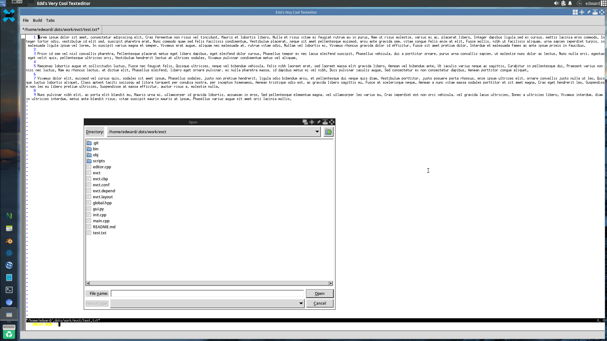

evct is a modal terminal text editor, written in pure C++. That means it doesn't use a GUI, but rather a text-based interface. It was all done from scratch, *without* the need of curses.h.

The name is an acronym. It stands for Edd's Very Cool Texteditor. No particular reason for choosing that name, it just sounded nice. It's a modal text editor that supports "primary modes" (INSERT, VISUAL, NORMAL) and "secondary modes" (which I plan to add as plug-ins in the near future).

## Screenshots

## How?
I wrote all the important subroutines in `editor.cpp`. This is where most of the TUI magic happens. What all the code really boils down to is just some ANSI/VT100 escape sequences and a little bit of creativity.

Below, you can see a list of all currently supported commands:

| Command | What it does                             |
|---------|------------------------------------------|
| :w      | Writes to the currently opened text file |
| :wq     | Also writes, but then exits the program  |
| :q!     | Quits the program without saving         |
| I (i)   | Enters -- INSERT -- pmode                |
| V (v)   | Enters -- VISUAL -- pmode                |
| X (x)   | Deletes the currently selected char      |
| Esc     | Enters -- NORMAL -- pmode                |
| arrows  | Navigate around the opened buffer        |
| :set    | Sets a variable/smode to 1 / 0           |

| Env variable     | What it does                  |
|------------------|-------------------------------|
|:set linum        | Enables/disables line numbers |
|:set syn          | Enables/disables highlighting |

## Installation guide

### *NIX (Text-mode & GUI)
Clone the repo, and compile main.cpp. Install the `tk` package via `pip`. You can now run both the GUI and the text-only version of evct.

### Win32/Text-mode
Clone the repo, and compile main.cpp. You will have a binary that already works out of the box.

### Win32/GUI
If you want to be able to use the GUI, install [cygwin](https://www.cygwin.com).

Open Cygwin, and install all packages necessary for running python/compiling C++ (but make sure you're using the Cygwin version of GCC, not any other compiler/MinGW GCC).

Install *xorg-x11-fonts-misc* (very important, fixes tabs)

Add Cygwin to your %PATH% environment variable, so that its commands will be recognized by Windows.

Press Win+R, then type "shell:startup" and hit enter. Open your start menu and you'll find Cygwin's XLaunch. Create a config with "multiple" windows and save it in the aforementioned shell:startup directory (make sure the file association is correct so that it opens X11 by default!) Now, X11 will start by default when you log in.

Now, if you're using an IDE there's one extra step: change your compiler to "Cygwin GCC". You can now run the GUI via the `launch_gui.bat` script.

## Issues
* On Windows, evct flickers a lot
* Also on Windows, you have to exit insert mode to use the arrow keys
